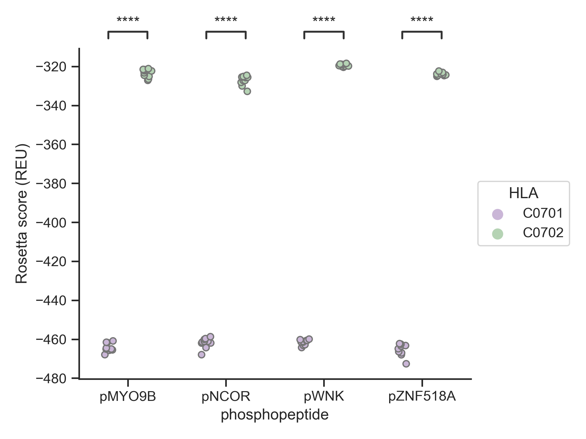

# peptideMHCdocking
Docking peptides of interest to MHC using a local installation of Rosetta Modeling Suite. 

## Requirements
- Local Rosetta3 installation
- Python3 with `pandas`, `statannot`, `seaborn`, `matplotlib`, `numpy`
- [`pretty_tsv`](https://gist.github.com/soxofaan/af407f793382623d039805f50144af6e):
```
function pretty_tsv {
    column -t -s $'\t' -n "$@" | less -F -S -X -K
}
```


## Manifest
`run_flexpepdock.sh`: Initialize simulation of 200 high resolution models given a prepared PDB file.

`assemble_scorefiles.py`: Concatenate score files of multiple simulations and annotate with HLA and peptide name

`plotScores.py`: Plot scores and add t-test annotation
<p align="center">

</p>

`residueAnalysis.py`: Breakdown Rosetta score by energy term and visualize each term's mean ddG between two structures.
<p align="center">

</p>
